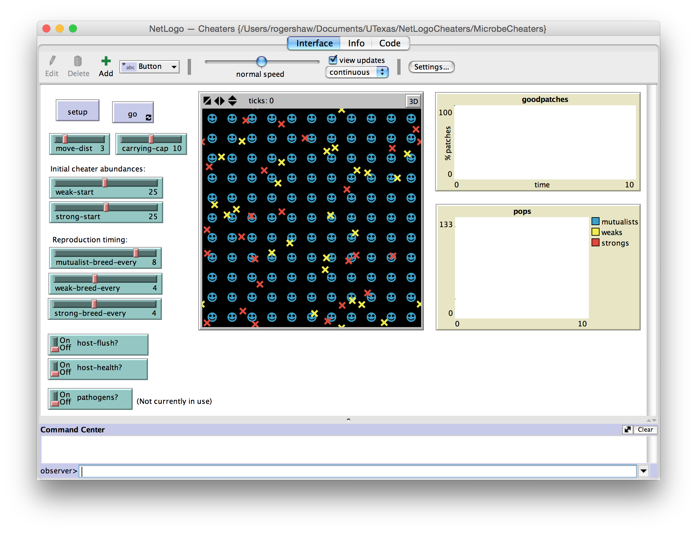

### What is it?

Illustrating the dynamics between a host, and its mutualist microbes, but with weak and strong cheaters mixed in as well. What allows the mutualist (and its host) to stop the spread of cheaters, and survive? How do the weak and strong cheaters interact?

### How it works

Three microbe species exist on a host: a mutualist, a weak cheater, and a strong cheater.

The mutualist supports the host's health, while the cheaters both steal from the host.

Some rules govern the local coexistence of these species.  When only the mutualist and the strong cheater are present on a patch, the strong cheater eliminates the mutualist. And when all three species are present, the strong cheater is eliminated.

So how does the mutualist (and its host) persist? Here, we explore whether host feedback mechanisms can help, by flushing itself, or just dying.

Things to vary include the reproductive rates of each species, and others(?).

In the end, we are interested in how many patches contain the mutualist microbe, and the population sizes of each species.

### How to use it

Click 'setup', and then 'go'! Click 'go' again the stop the model when you're satisfied. Adjust the 'host-health?' and 'host-flush?' switches to see how they affect the results.

### Extending the model

Pathogens may be another way to allow for mutualists to persist. To be done later?

### Related models

This model is based off the work by Pillai et al. (2014). We've added some host feedback mechanisms (and later, pathogens) to see how they affect the results.

### Credits and references

* Concept by Décio Correa and Catalina Cuellar-Gempeler, based off work by Pillai et al. (2014).
Coding by Roger Shaw.

* Pillai, P., Gouhier, T. C., and Vollmer, S. V. 2014. The cryptic role of biodiversity in the emergence of host–microbial mutualisms. Ecology letters, 17(11): 1437-1446.